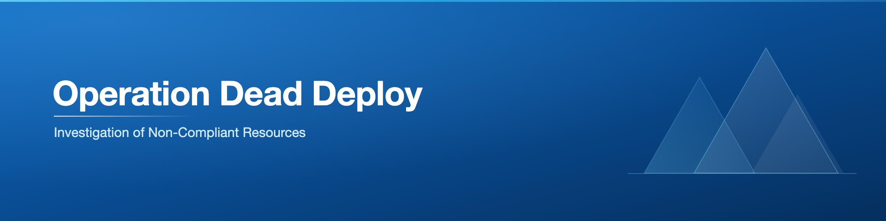
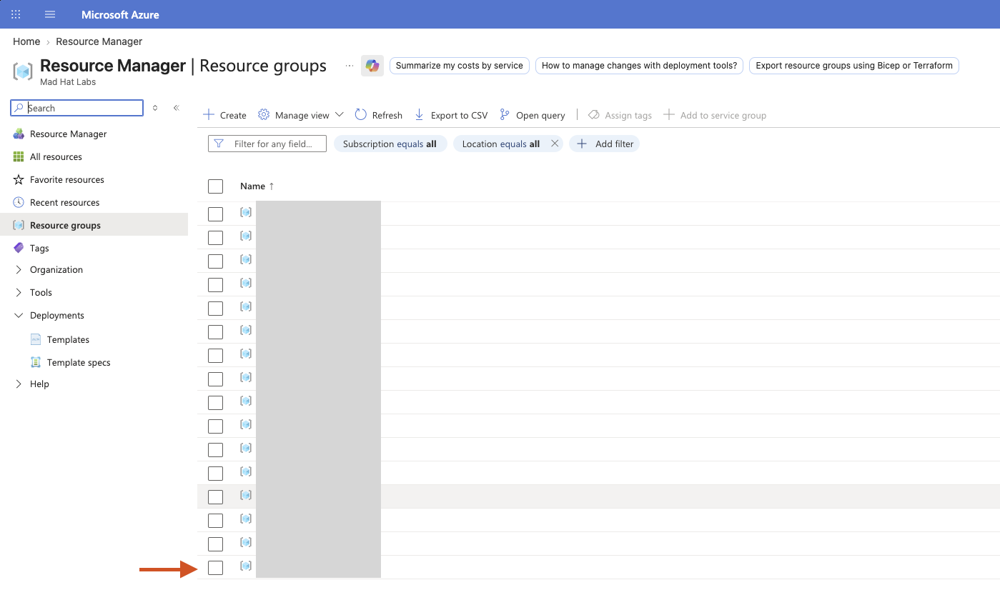
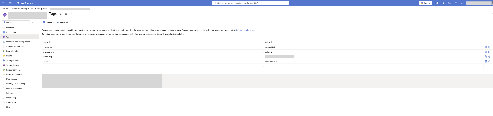
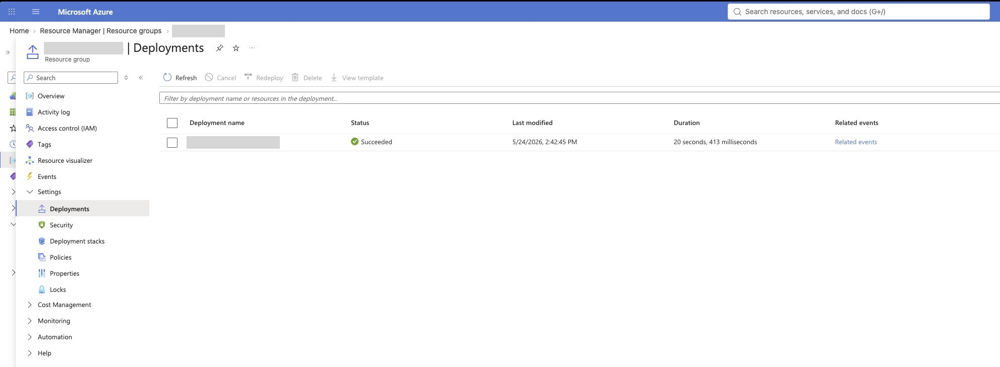
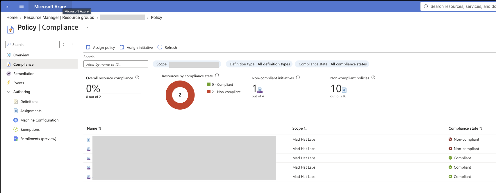
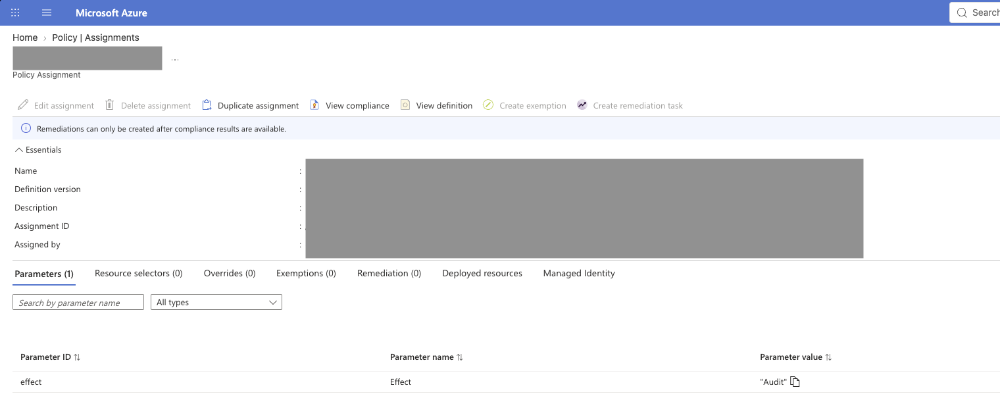

# Operation Dead Deploy: "Investigation of Non-Compliant Resources"

## Scenario
A junior intern was provided temporary contributor access to create a test environment. The intern quickly deployed the test environment and left for the weekend. Its been identified that the intern incorrectly deployed a test environment where its resources are misconfigured. The intern did not apply the companies governance policies and standards to the resource group. This investigation identifies the test resource group, misconfigured resources, potential damage, and which governance polices and standards failed.

## Environment
Operating in a live multi-user Azure training tenant with reader access.

## Investigation
1. To begin this operation, I navigated to the resource groups manager to see what resource group that the intern was working in. I identified the resource group created by the intern because it lacks the proper Microsoft naming convention. The interns improper naming convention shows that they did not adhere to deployment standards and can lead me to believe that the resources within it were misconfigured as well.
   
  

2. Then I performed reconnaissance on the resources within the resource group. I found that the intern added the intern-flag tag as instructed but the other tags are lacking important values. The intern did not specify what environment this is in and does not have a value for cost-center. This step gives reason to believe that the intern did not take the time to understand the companies governance and/or the deployment method did not follow a template or the deployment was misconfigured.

  
  
3. Then to trace the deployment, I reviewed the deployment section under the resource group to see when the resources were provisioned, what it created, who created it, and when the deployment occurred. This gives me a good position to see when exactly the resources were deployed and any related events with it. 

  

4. This step I checked what policies have applied and what the compliancy overview looks like. This shows me if the policies are being applied correctly and what policy effects are in place. I found that non-compliance has been found and when I looked further into the non-compliant policy. The details on the non-compliant policy showed why the resources were allowed to be created. The policy effect was set to audit.

  

  

## What broke / what surprised me
The navigation of the Azure lab took me a bit longer to figure out. When I went to go look into deployments to see details on the deployment of the test development, I found myself in the deployment tab of resource manager and not the resource group itself. It did surprise me to see the policy set to Audit, I know that in this case it was to display and teach the different policy effects. In my experience this type of effect would be blocked by the policy instead of logged.

## Findings and recommendations
I've determined that the policy effect was misconfigured. My findings and recommended potential fixes:
  - Configuring the non-compliant policy effect to deny.
  - The tags of the resource were not specified and in that case the policy for that should be set to append to ensure that the resources created have to meet compliant standards.
  - Implement a policy to deny deployments on the weekend to avoid other instances like this scenario. It would also ensure that malicous actors cannot deploy anything while important workers may not be available to respond quick enough to events like this. 

## What I learned
  - This lab solidified what I've learned. What I mean by this is actively putting the "why" behind actually doing the lab. Its easy to forget and just run through the motions of reconnaissance but the active recall with the hands-on approach has a more significant impact on knowing what I'm doing. 
  - It actively helped me learn how to start identifying incidents and what to look for.
  - How to Navigate Azure Cloud better than I could before.
